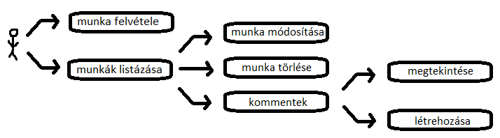
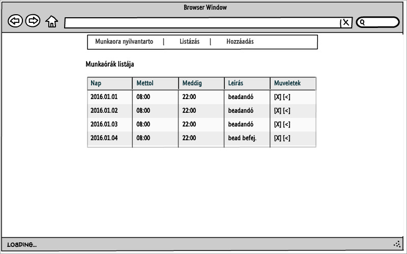
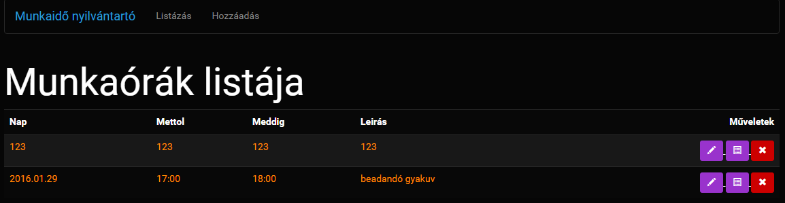

# Alkalmazások fejlesztése dokumentáció

## Követelményanalízis
1. Követelmények összegyűjtése
	1. Funkcionális elvárások:
		* A felhasználok tudják feljegyezni hogy melyik napon mettől meddig dolgoztak.
		* Legyen lehetőségük módosítani az esetleges változásokat.
		* Tudják törölni a munkaóráikat.
		* Az adminisztrátoroknak legyen lehetőségük jováhagyni a felhasználók által ledolgozott órákat.
		* A főoldalon az alkalmazás rövid ismertetése található
		* A felhasználók a jogosultsági szintüktől függően csak adott gombokat láthatnak.
	2. Nem funkcionális elvárások:
		* Felhasználóbarát, ergonomikus elrendezés és kinézet.
		* Gyors működés.
		* Biztonságos működés: jelszavak kódolt tárolása, funkciókhoz való hozzáférés.
2. Használati modell
	1. Szerepkörök
		* felhasználók (munkaórák rögzítése/listázása/módosítása/törlése)
		* adminisztátorok (munkaórák jóváhagyása)
	2. Használati diagramm
	
	

	3. Folyamatok pontos menete:
		- komment rögzítése:
			- munkaórák listázása
			- kommentek megjelenítése gombra kattintva feljönnek a kommentek
			- a szövegmezőbe a komment beírása
			- mentés gombbal a komment elmentése
		
		

## Tervezés
1. Architektúra terv
	1. Oldaltérkép
		* Felhasználó
			* Főoldal
			* Munkaórák listázása
				* Munkaóra módosítása
				* Munkaóra törlése
				* kommentek listázása
				    * Új komment létrehozása
			* Munkaóra létrehozása
			* 
	2. Végpontok
		* GET /munkaora.new: munkaóra rögzítés oldal
		* POST /munkaora.new: munkaóra adatok felküldése
		* GET /munkaora: munkaórák listázása oldal
		* GET /munkaora/:id : munkaóra módosítása oldal
		* POST /munkaora/:id : munkaóra módosított adatainak felküldése
		* GET /comment/:id : munkaóra kommentjeinek megtekintése

2. Felhasználóifelület-modell
	1. Oldalvázlat

		

	2. Designterv
	
		

3. Osztálymodell
	1. Adatmodell

		Munkaora 1 ───> * kommentek
		* nap              -komment szovege
		* mettol
		* meddig
		* leiras


## Implementáció
1. Fejlesztői környezet bemutatása
	Az alkalmazást egy online c9 nevű IDE-ben lett implementálva a Node.js alapokkal és egyéb modulok használatával.
2. Könyvtárstruktúrában lévő mappák funkiójának bemutatása
```
...
─app                        ROOT
 ├───pods                   adatmodellek
 │   ├───application        JSONAPI adapter tulajdonságok
 │   ├───comment            komment modell és megjelenés
 │   ├───components         oldalon megjelenő komponensek
 │   |   ├───comment-form   komment rögzítés komponense
 │   |   ├───munka-details  munkaóra megjelenítés komponense
 │   |   ├───munkaora-edit  munkaóra szerkesztés komponense
 │   |   └───munkaora-form  munkaóra rögzítés komponense
 │   ├───index              főoldal megjelenése
 │   ├───munkaora           munkaórák listázása
 │   |   ├───edit           munkaóra szerkesztése
 │   |   └───new            munkaóra rögzítése
 │   └───worktime           munkaóra modell
 └───styles                 stíluslapok
```


## Felhasználói dokumentáció

### A futtatáshoz ajánlott hardver-, szoftver konfiguráció

A futtatáshoz ajánlott hardver specifikációi megtalálhatóak a fejlesztői környezet aktuális verziójának a dokumentációjában.
A weboldal megtekintéséhez HTML5-öt támogató böngésző szükséges.

### Telepítés

A githubon található Download ZIP gombra kattintva a teljes projekt letölthető tömörített állományként, amennyiben nem a megosztott Cloud9 projektben, hanem egy újonnan létrehozottban szeretnénk azt használni.

### A program használata

A http://alkfejlbead2adatb-pirosalma.c9users.io/ oldalra navigálva (a szerver elindítása után) a program fogad bennünket. A jobb felső sarokban található "Bejelentkezés" gombra kattintva lehetőségünk van az alkalmazásba bejelentkezni, vagy amennyiben még nincs felhasználónk, regisztrálni.
Sikeres bejelentkezés után egy listát láthatunk a jelenleg felvitt telefonszámokról, és lehetőségünk van azok törlésére is.
Új telefonszám felvitele esetén minden mező kitöltése kötelező. A "dolgozó felvitele" gombra kattintva az újonnan felvitt telefonszám hozzáadásra kerül az adatbázishoz.
A telefonszámok listájánál a ceruza gombra kattintva szerkeszthetjük a már meglévő névjegyeinket, a szemetes ikonra kattintva pedig törölhetjük azokat.
Ha már nincs szükségünk a programra, akkor kijelentkezés után a webböngésző programért felelős lapjának bezárásával vethetünk véget a munkamenetünknek.